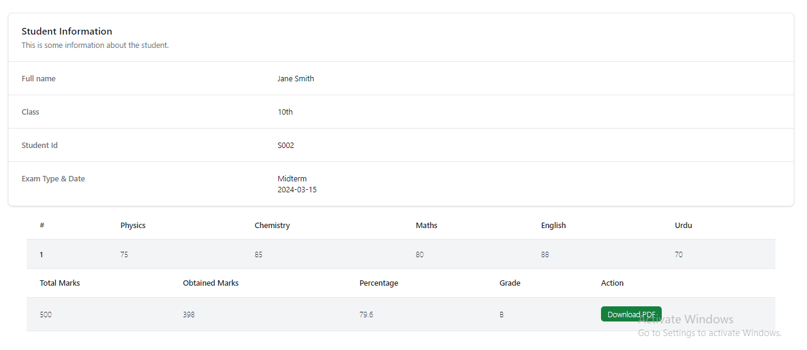

## Simple Result Checking System
Here is simple result checking system created with NodeJs, Express, EJS.

### Features
<ul>
  <li>Simple Excel Result to JSON</li>
  <li>User Can Search Results</li>
  <li>Download PDF (_In next Video_)
</li>
  <li>No Additional Database Connection</li>
</ul>

This is simple beginner based project.
Learn [Watch Video on YouTube](https://youtube.com/@sarfarazunarr)
